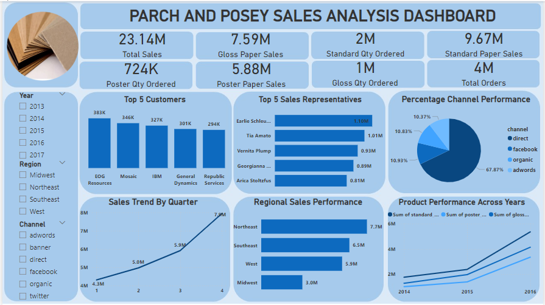

# Parch and Posey Sales Analysis

## Dashboard

# Introduction
This report provides an overview of sales performance for Parch and Posey Paper Company during a five year period using Power BI. It highlights key trends, performance metrics, and actionable insights to support strategic decision-making.

# Data and Methodology
In this section, I'll give a brief overview of the dataset and the method I'll use to carry out this analysis.

## Dataset Overview
The Parch and Posey dataset has 5 tables, and their details include:

**1. Orders**: This table contains all the orders made to the company by our three customers and the prices paid for these various orders. The table has 11 columns and 6,912 rows.

**2. Accounts**: This table contains a bit of information about our customers and the company. The table has 7 columns and 351 rows.

**3. Sales_rep**: This table contains information about our sales representatives. The table has 3 columns and 351 rows.  

**4. Web_events**: This table contains information about the various advertisement channels. The table has 4 columns and 9,073 rows. 

**5. Region**: This table contains information about the regions where our company is established. The table has 2 columns and 4 rows.

## Tools Used
Power BI for data visualization and analysis.

## Methodology and Metrics

This analysis used sales data, customer behavior, and market trends, focusing on key metrics:

**1. Sales Performance**: Analyzed revenue growth and sales distribution across products and regions to identify trends and risks.

**2. Channel Effectiveness**: Measured sales contribution across marketing channels (e.g., Adwords, organic, social media).

**3. Regional Analysis**: Compared sales across regions to assess performance and uncover growth opportunities.

**4. Sales Rep Efficiency**: Evaluated individual rep performance based on sales contribution.

**5. Seasonal Trends**: Examined quarterly sales to identify seasonal patterns and alignment with inventory levels.

**6. Customer Risk**: Assessed revenue concentration among top customers and identified opportunities for diversification.

**7. Product Innovation**: Analyzed product sales trends to identify potential for innovation, focusing on customer preferences.

# Analysis
## Top 5 Customers
### Question 1
What steps can we take to diversify our customer base and reduce reliance on top customers to mitigate revenue risks?

### Finding
- EOG Resources generated 383K in sales, securing its position as the leading customer. However, the sales difference between EOG Resources and the other top five customers is relatively narrow.
- The top five customers contribute significantly to revenue, but this exposes the business to concentration risk. If one or more key customers (e.g., EOG Resources) reduces orders or switches to competitors, it could heavily impact sales.

### Recommendation 
- Introduce tiered discounting for smaller customers to encourage higher spending.
- Develop industry-specific marketing efforts targeting underrepresented sectors.
- Launch a customer retention program, focusing on exclusive benefits for high-value clients to secure long-term partnerships.

## Top 5 Sales Representatives 
### Question 2
How can we empower underperforming sales representatives to increase their contribution and reduce dependency on top-performing reps?

### Finding 
- Earle Schleuter achieved 1.10M in sales, the highest among representatives.
- Sales are heavily reliant on top performers like Earlie Schleuter and Tris Amato, while other sales reps collectively contribute less than 3.8M. This dependency poses a risk if top performers leave or underperform.

### Recommendation 
- Share Earle Schleuter's successful strategies with the other sales representatives to boost their performance.
- Pair top reps with lower performers in mentorship programs.

## Percentage Channel Performance
### Question 3
Which channel reaches the widest audience, and what strategies can we implement to reduce dependency on it while improving performance across underutilized channels?

### Finding 
- The direct channel generates nearly 70% of total sales, creating a single-point dependency. 
- Other channels like direct, organic, and social media underperform relative to their potential in multi-channel sales ecosystems.

### Recommendation 
- Invest more in direct advertisement while testing strategies to improve performance in underperforming channels like organic and adwords.
- Use targeted A/B testing for direct and social channels to improve conversion rates.
- Transition part of the adwords budget to emerging platforms (e.g., TikTok or Instagram for social commerce).

## Sales Trend by Quarter
### Question 4
What promotions, campaigns, or strategies can we implement in low-performing quarters to balance sales performance throughout the year?

### Finding 
- The fourth-quarter peak (7.2M) strongly suggests sales are influenced by seasonal demand (e.g., holidays, end-of-year campaigns). 
- However, earlier quarters show lower-than-average growth, indicating potential for better distribution of sales across the year.

### Recommendation 
- Introduce promotional events during Q1 and Q2, such as “New Year Discounts” or “Spring Campaigns.”
- Offer early bulk-order incentives to corporate clients in Q3 to smoothen revenue streams.
- Use historical data to align inventory levels and reduce operational costs during off-peak periods.

## Regional Sales Performance
### Question 5
What are the key barriers to higher sales in the lowest-performing region, and how can we tailor our approach to drive growth in this market

### Finding 
- Northeast achieved the highest sales at 7.1M, while the Midwest had the lowest at 3.0M.
- The Midwest's underperformance may relate to unmet product needs, weaker marketing, distribution issues, or fewer population.

### Recommendation 
- Investigate successful approaches in the Northeast and apply them to underperforming regions like the Midwest.
- Identify product-market fit issues using surveys and regional focus groups.
- Optimize distribution and partnerships in underserved Midwest regions.
- Tailor campaigns with messaging specific to the Midwest demographic, leveraging localized branding.

## Product Performance Across Years 
### Question 6
What is the sales trend, and how can we boost sales of the least demanded paper while sustaining sales of the most demanded product?

### Finding 
- The chart reveals the sales trends over the selected years, showing consistent growth in the years with complete data. Excluding the incomplete years (2013 and 2017) allowed for a more accurate and fair comparison, highlighting key patterns and trends that would have been skewed by missing data
- Product sales (Standard, Poster, Gloss) reached their highest in 2016.
- While standard paper contributes the highest revenue, poster paper sales (5.88M) show the fastest growth trend across years. This indicates a shifting customer preference toward specialized, possibly premium products.

### Recommendation 
- Analyze market trends and factors that led to the 2016 peak to identify opportunities for similar future growth.
- Focus on developing and marketing niche or value-added products like poster paper. Conduct further segmentation to understand the industries or customer types driving poster paper demand (e.g., advertising, creative design). Use this data to offer bundled solutions or tiered pricing models to maximize profitability.

# Conclusion
By strategically analyzing the product portfolio, channel performance, regional opportunities, sales representative efficiency, seasonal patterns, customer performance risks, and the potential for product innovation, we can identify actionable insights that drive growth and mitigate risks. Implementing these recommendations will enable the business to optimize its operations, diversify its revenue streams, and enhance its competitive edge. A data-driven approach, focusing on predictive analytics and proactive decision-making, will further empower the organization to navigate challenges and seize new opportunities, ensuring long-term success and sustainability
